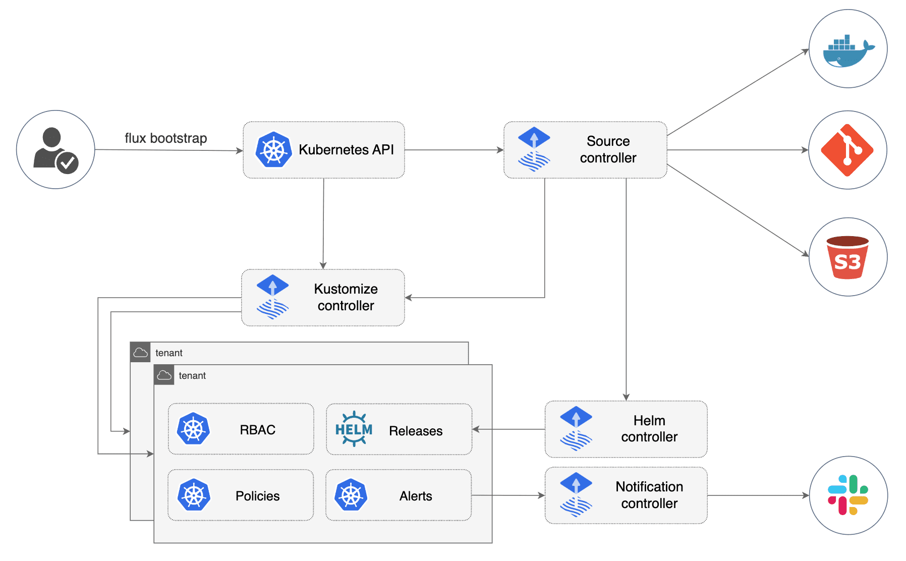
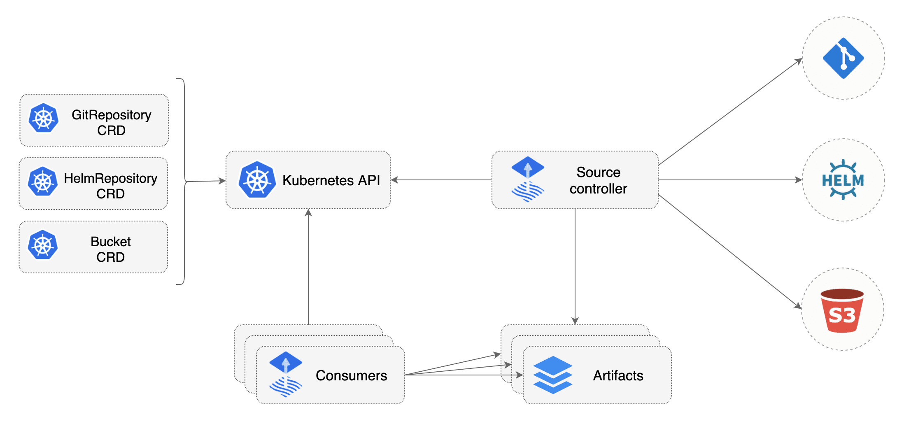
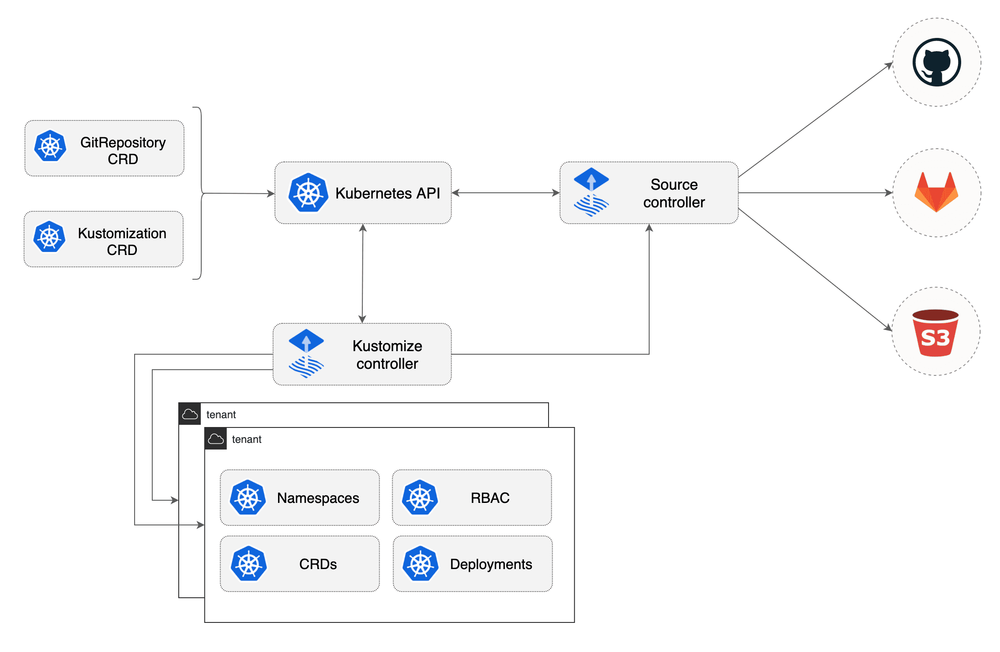
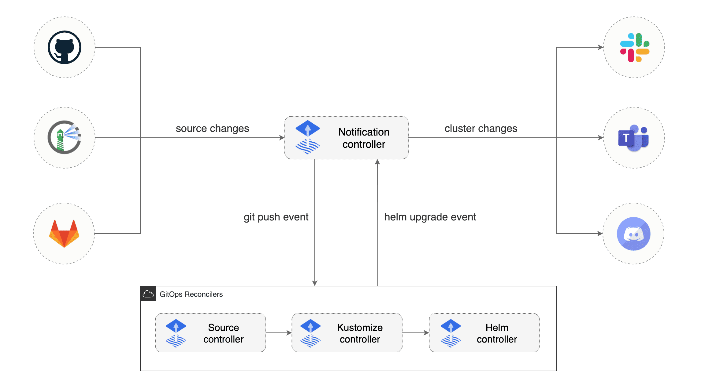
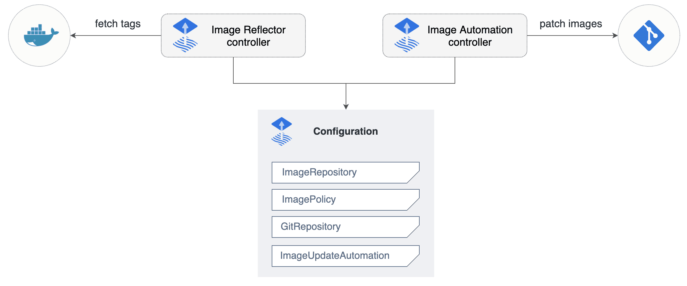

# Install and configure Flux with Minikube cluster and connect to an external GitHub repository via SSH keys

## Table of contents:
1. [Tasks](#tasks)
2. [Overview](#overview)
3. [How Flux works](#how-flux-works)
4. [Flux components](#flux-components)

## Tasks
1. Install Minikube
2. Install Flux CLI
3. Install Flux

## Terms and concepts
- [An Introduction to Kustomize](https://blog.scottlowe.org/2019/09/13/an-introduction-to-kustomize/)

## Overview

[Flux](https://fluxcd.io/flux/) is a tool that watches your Git repository for changes and automatically applies those changes to your cluster when there is new code to deploy. It is a pioneering tool in implementing GitOps practice that was introduced by Weaveworks. 

This workshop shows how to provision Flux operator in Minikube cluster and connect to an external GitHub repository via SSH keys Alternative popular option is to use personal access tokens (PAT) to bootstrap Flux and connect to GitHub. In this case, Flux will create repository and commit the required Kubernetes manifest files. For more information about bootstrapping Flux with PAT, see [Flux Get Started](https://fluxcd.io/flux/get-started/).

When properly managed SSH keys are often considered more secure option than PATs.

## How Flux works

Flux is based on a set of Kubernetes API extensions (“custom resources”), which control how git repositories and other sources of configuration are applied into the cluster (“synced”). For example, you create a `GitRepository` object to mirror configuration from a Git repository, then a `Kustomization` object to sync that configuration.

## Flux components



The main components of Flux are:
- [Source controller](https://fluxcd.io/flux/components/source/)
- [Kustomize controller](https://fluxcd.io/flux/components/kustomize/)
- [Helm controller](https://fluxcd.io/flux/components/helm/)
- [Notification controller](https://fluxcd.io/flux/components/notification/)
- [Image reflector and automation controller](https://fluxcd.io/flux/components/image/)

All of these components form the `GitOps toolkit controllers`.



### Source controller
- Manages Git repositories, Helm repositories, OCI artifacts, Helm charts and Cloud Provider Buckets as sources.
- Fetches updates from repositories and provides the contents to other controllers.
- Keeps track of changes in the source repositories to trigger reconciliations.

### Kustomize controller

- Applies Kubernetes manifests defined in the Git repository.
- Supports [Kustomize](https://kustomize.io/) overlays for managing Kubernetes resource configurations.
- Handles reconciliation of the Kubernetes resources by applying the manifests to the cluster.



### Helm controller

The Helm Controller is a Kubernetes operator, allowing one to declaratively manage Helm chart releases with Kubernetes manifests.

The desired state of a Helm release is described through a Kubernetes Custom Resource named `HelmRelease`. Based on the creation, mutation or removal of a `HelmRelease` resource in the cluster, Helm actions are performed by the controller.

- Manages Helm charts and releases.
- Installs, upgrades, and rolls back Helm charts as defined in the Git repository.
- Works with Helm repositories and OCI-based Helm charts.


### Notification controller

The Notification Controller is a Kubernetes operator, specialized in handling inbound and outbound events.

The controller handles events coming from external systems (GitHub, GitLab, Bitbucket, Harbor, Jenkins, etc) and notifies the GitOps toolkit controllers about source changes.

- Handles alerting and notifications.
- Sends messages to external systems such as Slack, Microsoft Teams, or custom webhooks when changes are applied.
- Facilitates better observability of GitOps activities.



### Image reflector and automation controller

The image-reflector-controller and image-automation-controller work together to update a Git repository when new container images are available.

- The image-reflector-controller scans image repositories and reflects the image metadata in Kubernetes resources.
- The image-automation-controller updates YAML files based on the latest images scanned, and commits the changes to a given Git repository.
- Supports policies to control which images and tags are deployed.



## Workshop

### Install and start Minikube

To install Minikube, see [Minikube Get Started](https://minikube.sigs.k8s.io/docs/start/?arch=%2Flinux%2Fx86-64%2Fstable%2Fbinary+download)

To run Minikube cluster:
```bash
minikube start
```

To run with several worker nodes:
```bash
minikube start --nodes=3
```

### Create GitHub repository or use existing one

If the repository does not exist, you must create it manually on GitHub beforehand (using either the web UI, `gh` CLI, or Git commands).

Repository cab either be public or private.

### Generate SSH keys and test connectivity to GitHub

Generate SSH keys and import the public key to GitHub. For more information, see [Gitlab's guide on generating SSH keys](https://docs.gitlab.com/ee/user/ssh.html)

Confirm that your SSH keys are correctly set up and associated with your GitHub account. You can test this using:
```bash
ssh -T git@github.com
```

### Configure Flux to use SSH

Flux needs to clone the repository on your behalf, so it needs access to the private SSH key corresponding to the public key associated with your GitHub account.

Create `flux-system` namespace in cluster:
```bash
kubectl create ns flux-system
```

During the bootstrap process, you need to configure Flux to use the SSH key. This typically involves adding the private key to Kubernetes as a secret. For example:
```bash
kubectl create secret generic flux-system \
  --namespace=flux-system \
  --from-file=identity=$HOME/.ssh/id_rsa
```

Replace `$HOME/.ssh/id_rsa` with the path to your private SSH key.

To check secret:
```bash
kubectl get secret -n flux-system
```

### Bootstrap Flux

Check that your cluster can install Flux:
```bash
flux check --pre
```

To bootstrap Flux into given repository and specific folder (ensure that folder already exists in remote repository):
```bash
flux bootstrap git \
  --url=ssh://git@github.com/your-username/your-repo.git \
  --private-key-file=$HOME/.ssh/id_rsa \
  --path=<folder_name>
```

**NOTE**  
Kubernetes secrets store data in base64 encoded format which is not secure. As a best practice it is recommended to use Secrets Managers or encryptors like [`sops`](https://maxat-akbanov.com/securing-secrets-with-sops-an-introduction) or [*sealed secrets*](https://github.com/bitnami-labs/sealed-secrets) to encrypt secrets at Git repository and cluster runtime levels.

When running the bootstrap command, the following happens:
1. Flux will create its configuration files (like `kustomization.yaml` and other resources) inside the specified folder (`flux-config`).
2. The folder will contain the manifests required to bootstrap Flux, such as the `GitRepository` and `Kustomization` resources.

After bootstrapping, check that the folder is created in your repository and contains the expected configuration files. 

### Fork podinfo repository for app deployment

The [`podinfo`](https://github.com/stefanprodan/podinfo) is a open-source project that contains  a tiny web application made with Go that showcases best practices of running microservices in Kubernetes. Podinfo is used by CNCF projects like Flux and Flagger for end-to-end testing and workshops.

To deploy `podinfo` app, fork the repository from [https://github.com/stefanprodan/podinfo](https://github.com/stefanprodan/podinfo).

Clone the forked repository to your local machine
```bash
git clone git@github.com:your-username/podinfo.git
cd podinfo
```